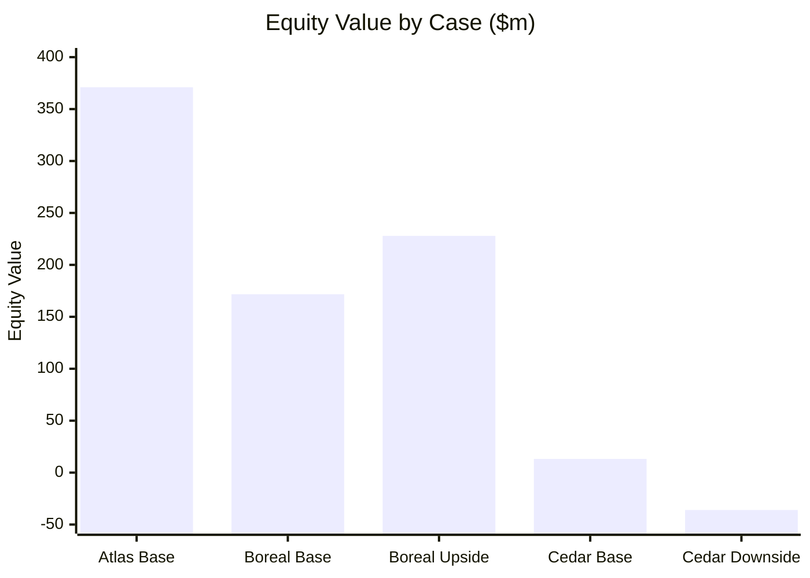
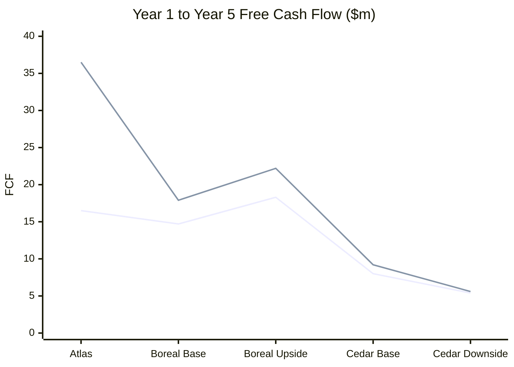
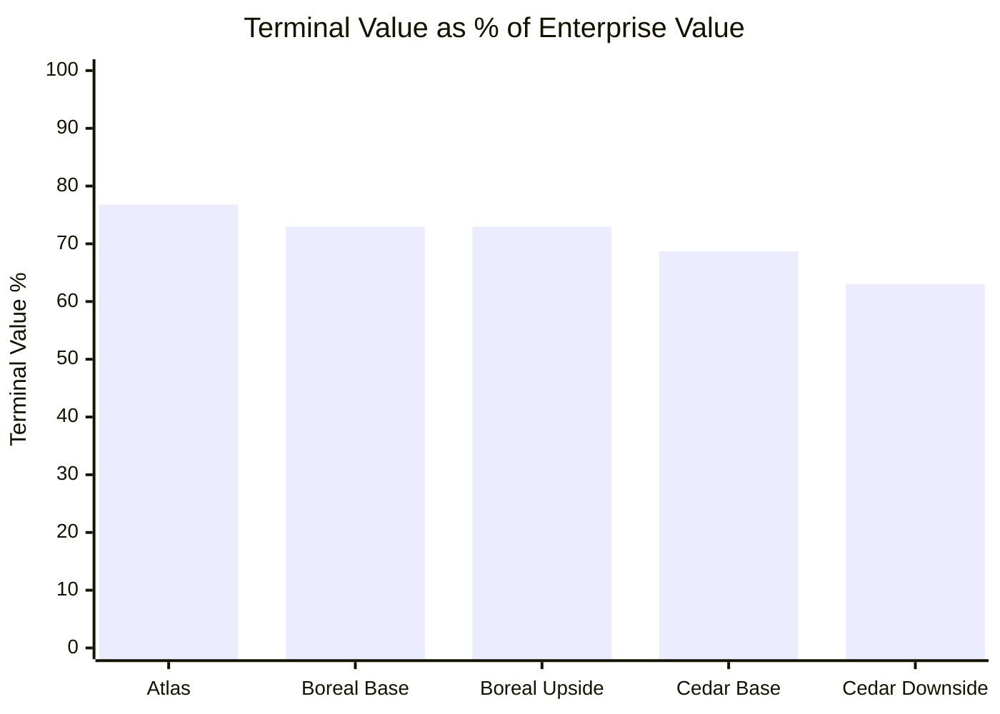
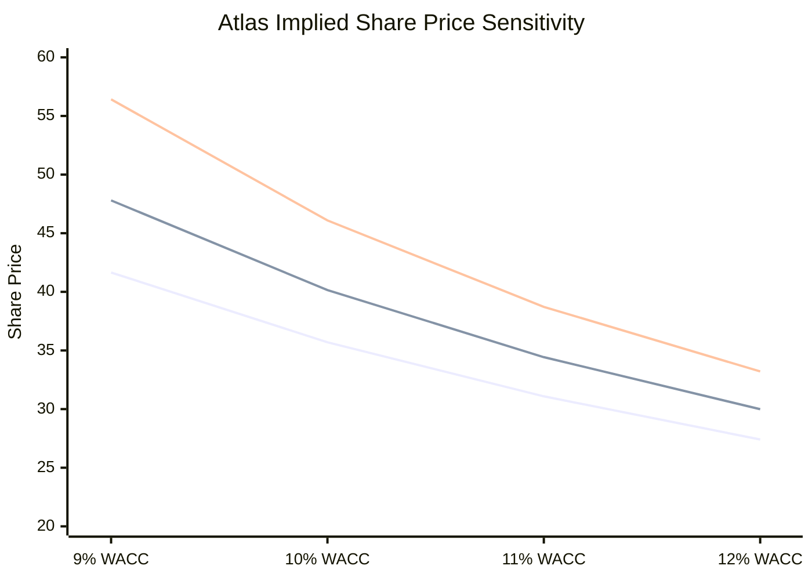
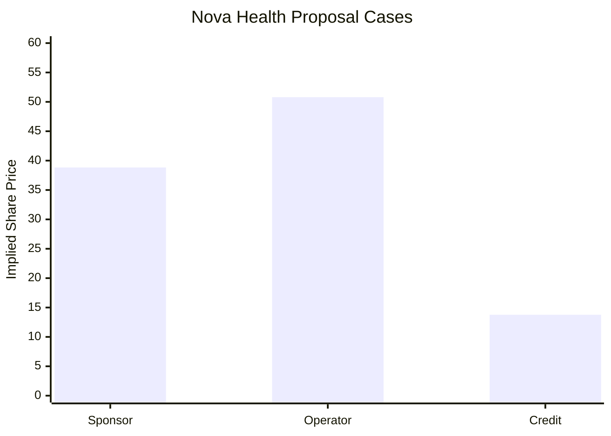
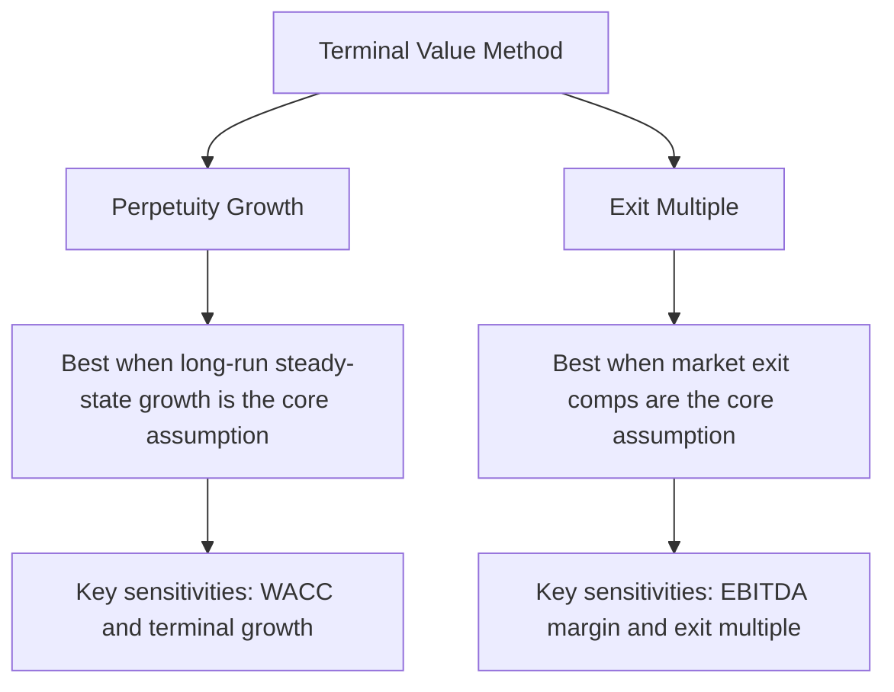
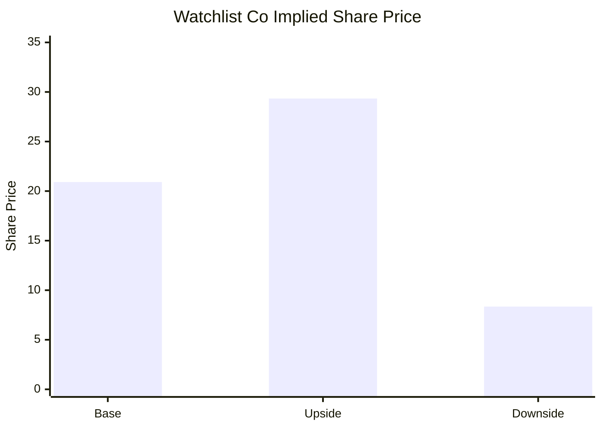

# DCF CLI

`dcf` is an append-only command-line tool for discounted cash flow analysis. It
stores every assumption change, scenario revision, proposal, model run, and
integrity log entry under a local `.dcf/` directory so a valuation can be
reviewed, reproduced, and exported later.

The current implementation focuses on:

- Durable DCF project storage.
- Append-only assumption and scenario records.
- DCF calculations with reusable scenarios.
- Proposal capture for user- or system-submitted investment cases.
- Cross-scenario comparison.
- Sensitivity analysis.
- Excel export with formulas, inputs, audit, sensitivity, and charts.
- Local integrity verification.

It does **not** generate investment recommendations, call LLM APIs, simulate
agents, or decide which opportunity is best. External tools or humans can submit
proposal values; this package stores, calculates, compares, and exports them.

## Installation

From this repository:

```bash
python -m pip install -e .
```

During local development you can also run the CLI without installing:

```bash
PYTHONPATH=. python -m dcf --help
```

The package depends on `openpyxl` for Excel export.

## Core Concepts

### Project Directory

A DCF project is a directory containing a `.dcf/` folder. All tool state lives
under `.dcf/`.

```text
.dcf/
  config.json
  log.jsonl
  assumptions/
  scenarios/
  runs/
  proposals/
  imports/
  historicals/
  import_maps/
```

The storage model is append-only. Existing JSON artifacts are not edited.
Current state is derived by scanning the latest records.

### Assumptions

Assumptions are dot-separated keys:

```text
revenue.initial
revenue.growth_rate
margins.ebit
tax_rate
capex.pct_revenue
depreciation.pct_revenue
working_capital.pct_revenue
wacc
terminal.growth_rate
terminal.exit_multiple
net_debt
shares_outstanding
```

The minimal model needs:

```text
revenue.initial
revenue.growth_rate
margins.ebit
tax_rate
capex.pct_revenue
wacc
```

Optional assumptions improve realism:

- `depreciation.pct_revenue`: adds D&A and EBITDA.
- `working_capital.pct_revenue`: models net working capital and change in NWC.
- `terminal.growth_rate`: Gordon growth terminal value.
- `terminal.exit_multiple`: exit multiple terminal value.
- `net_debt`: bridge from enterprise value to equity value.
- `shares_outstanding`: implied share price.

`terminal.growth_rate` and `terminal.exit_multiple` are mutually exclusive.

### Scenarios

A scenario is a named set of overrides pinned to a base assumption version.
Examples: `base`, `bull`, `bear`, `management`, `downside`.

Scenario changes create new scenario revision files. Prior revisions remain on
disk.

### Proposals

Proposal sessions capture assumption sets from humans or external systems.
They are useful when several investors, operators, analysts, or automated tools
submit alternative cases for the same opportunity.

The package stores the proposal values and rationale. It does not create the
proposal itself.

### Runs

A run resolves the selected scenario or proposal into a full input set, computes
DCF outputs, and stores the run artifact.

### Verify

`dcf verify` checks logged artifact hashes, missing artifacts, unexpected files,
and the local log hash chain.

## Quickstart

Create a project:

```bash
mkdir acme-dcf
cd acme-dcf
dcf init --company "Acme Software" --author jane --years 5
```

Set core assumptions:

```bash
dcf assume set revenue.initial 100000000 --author jane
dcf assume set revenue.growth_rate 0.12 --author jane
dcf assume set margins.ebit 0.24 --author jane
dcf assume set tax_rate 0.21 --author jane
dcf assume set capex.pct_revenue 0.04 --author jane
dcf assume set depreciation.pct_revenue 0.03 --author jane
dcf assume set working_capital.pct_revenue 0.10 --author jane
dcf assume set wacc 0.095 --author jane
dcf assume set terminal.growth_rate 0.025 --author jane
dcf assume set net_debt 150000000 --author jane
dcf assume set shares_outstanding 25000000 --author jane
```

Run the base case:

```bash
dcf run --tag "base case" --format json
```

Create a bull and bear case:

```bash
dcf scenario create bull --from base --author jane
dcf scenario set bull revenue.growth_rate 0.16 --author jane
dcf scenario set bull margins.ebit 0.28 --author jane

dcf scenario create bear --from base --author jane
dcf scenario set bear revenue.growth_rate 0.06 --author jane
dcf scenario set bear margins.ebit 0.18 --author jane
dcf scenario set bear wacc 0.11 --author jane
```

Compare the cases:

```bash
dcf scenario compare base bull bear --run --format json
```

Run sensitivity:

```bash
dcf sensitivity wacc terminal.growth_rate \
  --scenario base \
  --metric implied_share_price \
  --format json
```

Export to Excel:

```bash
dcf export excel --scenario base --out acme_base_case.xlsx
```

Open `acme_base_case.xlsx` in Excel. It contains:

- `Inputs`: editable assumptions.
- `DCF`: formula-driven valuation.
- `Audit`: resolved assumptions and metadata.
- `Sensitivity`: WACC vs terminal growth grid.
- Charts on the DCF sheet.

Verify the project:

```bash
dcf verify --format json
```

## Example Output Formats

Most examples below include compact result tables. The values are illustrative
outputs generated by the current CLI implementation from the assumptions shown
in each example.

For visualizations in this README, Mermaid charts are used because they render
directly on GitHub. Excel exports also include workbook-native charts.

## Worked Example 1: Comparing Three Acquisition Targets

Assume you are evaluating three private companies:

- **Atlas Cloud**: high-growth SaaS with strong margins.
- **Boreal Industrial**: slower-growth industrial services business.
- **Cedar Retail**: consumer retail chain with lower margins and higher working
  capital needs.

The cleanest current workflow is one `.dcf` project per investment opportunity,
then compare their exported JSON outputs or Excel workbooks.

### Atlas Cloud

```bash
mkdir atlas-cloud
cd atlas-cloud
dcf init --company "Atlas Cloud" --author ic --years 5

dcf assume set revenue.initial 80000000 --author ic
dcf assume set revenue.growth_rate 0.22 --author ic
dcf assume set margins.ebit 0.24 --author ic
dcf assume set tax_rate 0.21 --author ic
dcf assume set capex.pct_revenue 0.03 --author ic
dcf assume set depreciation.pct_revenue 0.02 --author ic
dcf assume set working_capital.pct_revenue 0.06 --author ic
dcf assume set wacc 0.105 --author ic
dcf assume set terminal.growth_rate 0.03 --author ic
dcf assume set net_debt 25000000 --author ic
dcf assume set shares_outstanding 10000000 --author ic

dcf run --tag "Atlas base" --format json
dcf export excel --scenario base --out atlas_cloud_base.xlsx
```

Atlas is modeled with strong revenue growth, modest capex, and low working
capital intensity. This type of business will usually be highly sensitive to
terminal assumptions because more value sits in later years.

Run a tighter sensitivity grid:

```bash
dcf sensitivity wacc 0.09:0.12:7 terminal.growth_rate 0.02:0.04:5 \
  --metric implied_share_price \
  --format json
```

### Boreal Industrial

```bash
mkdir ../boreal-industrial
cd ../boreal-industrial
dcf init --company "Boreal Industrial" --author ic --years 5

dcf assume set revenue.initial 140000000 --author ic
dcf assume set revenue.growth_rate 0.05 --author ic
dcf assume set margins.ebit 0.16 --author ic
dcf assume set tax_rate 0.24 --author ic
dcf assume set capex.pct_revenue 0.06 --author ic
dcf assume set depreciation.pct_revenue 0.045 --author ic
dcf assume set working_capital.pct_revenue 0.14 --author ic
dcf assume set wacc 0.09 --author ic
dcf assume set terminal.growth_rate 0.02 --author ic
dcf assume set net_debt 60000000 --author ic
dcf assume set shares_outstanding 12000000 --author ic

dcf run --tag "Boreal base" --format json
dcf export excel --scenario base --out boreal_industrial_base.xlsx
```

Boreal has lower growth, higher capex, and higher working capital intensity.
It is less of a terminal-growth story and more of a cash conversion story.

Create an operational improvement case:

```bash
dcf scenario create margin-upside --from base --author ic
dcf scenario set margin-upside margins.ebit 0.19 --author ic
dcf scenario set margin-upside working_capital.pct_revenue 0.11 --author ic
dcf scenario compare base margin-upside --run --format json
dcf run --scenario margin-upside --tag "Boreal margin upside" --format json
dcf export excel --scenario margin-upside --out boreal_margin_upside.xlsx
```

### Cedar Retail

```bash
mkdir ../cedar-retail
cd ../cedar-retail
dcf init --company "Cedar Retail" --author ic --years 5

dcf assume set revenue.initial 220000000 --author ic
dcf assume set revenue.growth_rate 0.035 --author ic
dcf assume set margins.ebit 0.075 --author ic
dcf assume set tax_rate 0.25 --author ic
dcf assume set capex.pct_revenue 0.05 --author ic
dcf assume set depreciation.pct_revenue 0.035 --author ic
dcf assume set working_capital.pct_revenue 0.18 --author ic
dcf assume set wacc 0.10 --author ic
dcf assume set terminal.growth_rate 0.018 --author ic
dcf assume set net_debt 90000000 --author ic
dcf assume set shares_outstanding 15000000 --author ic

dcf run --tag "Cedar base" --format json
dcf export excel --scenario base --out cedar_retail_base.xlsx
```

Cedar is more exposed to margin and working capital assumptions. A small EBIT
margin miss can matter more than a modest change in long-term growth.

Create a downside case:

```bash
dcf scenario create downside --from base --author ic
dcf scenario set downside revenue.growth_rate 0.01 --author ic
dcf scenario set downside margins.ebit 0.055 --author ic
dcf scenario set downside working_capital.pct_revenue 0.21 --author ic
dcf scenario set downside wacc 0.115 --author ic

dcf scenario compare base downside --run --format json
dcf run --scenario downside --tag "Cedar downside" --format json
dcf export excel --scenario downside --out cedar_downside.xlsx
```

### Comparing the Three Opportunities

For now, cross-company comparison is done by running each project and collecting
headline metrics:

```bash
cd ../atlas-cloud
dcf show --format json

cd ../boreal-industrial
dcf show --scenario margin-upside --format json

cd ../cedar-retail
dcf show --scenario downside --format json
```

In each JSON output, compare:

- `outputs.enterprise_value`
- `outputs.equity_value`
- `outputs.implied_share_price`
- `outputs.terminal_value_pct`
- `outputs.free_cash_flows`

Investment committee questions to ask:

- Which deal has the highest value under base assumptions?
- Which has the lowest terminal value percentage?
- Which has the most resilient downside case?
- Which depends most on margin expansion?
- Which depends most on terminal growth or exit multiple?
- Which has the strongest near-term free cash flow?

### Acquisition Target Results

The following table summarizes modeled outputs from the three target examples
above.

| Opportunity | Scenario | Enterprise Value | Equity Value | Implied Share Price | Terminal Value % | Year 1 FCF | Year 5 FCF |
|---|---:|---:|---:|---:|---:|---:|---:|
| Atlas Cloud | base | $396.0m | $371.0m | $37.10 | 76.8% | $16.5m | $36.5m |
| Boreal Industrial | base | $231.7m | $171.7m | $14.31 | 73.0% | $14.7m | $17.9m |
| Boreal Industrial | margin-upside | $287.9m | $227.9m | $18.99 | 73.0% | $18.3m | $22.2m |
| Cedar Retail | base | $103.2m | $13.2m | $0.88 | 68.7% | $8.0m | $9.2m |
| Cedar Retail | downside | $54.0m | $(36.0)m | $(2.40) | 63.0% | $5.4m | $5.6m |

### Visual: Equity Value by Opportunity



### Visual: Free Cash Flow Growth



### Visual: Terminal Value Dependence



Interpretation:

- Atlas has the highest modeled equity value and strongest FCF growth, but also
  the highest terminal value dependence.
- Boreal's margin-upside scenario creates meaningful value without changing the
  terminal value percentage. The value creation comes from operating cash flow.
- Cedar's downside case produces negative equity value after net debt, which
  flags leverage and operating sensitivity as the key diligence issues.

### Atlas Sensitivity Result

For Atlas Cloud, the WACC vs terminal growth sensitivity on implied share price
looks like this:

| WACC \\ Terminal Growth | 2.0% | 3.0% | 4.0% |
|---:|---:|---:|---:|
| 9.0% | $41.65 | $47.80 | $56.42 |
| 10.0% | $35.70 | $40.15 | $46.09 |
| 11.0% | $31.09 | $34.43 | $38.72 |
| 12.0% | $27.41 | $29.99 | $33.21 |



This is the kind of business where a small terminal assumption change can move
the valuation materially.

## Worked Example 2: Investment Committee Proposal Session

Use proposal sessions when several people submit different assumption sets for
one opportunity.

```bash
mkdir nova-health
cd nova-health
dcf init --company "Nova Health" --author ic --years 5

dcf assume set revenue.initial 120000000 --author ic
dcf assume set revenue.growth_rate 0.10 --author ic
dcf assume set margins.ebit 0.18 --author ic
dcf assume set tax_rate 0.23 --author ic
dcf assume set capex.pct_revenue 0.04 --author ic
dcf assume set depreciation.pct_revenue 0.03 --author ic
dcf assume set working_capital.pct_revenue 0.09 --author ic
dcf assume set wacc 0.095 --author ic
dcf assume set terminal.growth_rate 0.025 --author ic
dcf assume set net_debt 40000000 --author ic
dcf assume set shares_outstanding 8000000 --author ic
```

Create a session:

```bash
dcf proposal session create \
  --participant partner \
  --participant operator \
  --participant credit \
  --label "Nova Health IC cases" \
  --format json
```

Submit three views:

```bash
dcf proposal submit --session s001 \
  --participant partner \
  --label "Base sponsor case" \
  --set revenue.growth_rate=0.12 \
  --set margins.ebit=0.20 \
  --rationale revenue.growth_rate="New clinic openings support low-teens growth" \
  --format json

dcf proposal submit --session s001 \
  --participant operator \
  --label "Operational upside" \
  --set revenue.growth_rate=0.14 \
  --set margins.ebit=0.23 \
  --set working_capital.pct_revenue=0.075 \
  --rationale margins.ebit="Procurement and scheduling improvements" \
  --format json

dcf proposal submit --session s001 \
  --participant credit \
  --label "Downside credit case" \
  --set revenue.growth_rate=0.05 \
  --set margins.ebit=0.14 \
  --set wacc=0.11 \
  --rationale wacc="Higher leverage and reimbursement risk" \
  --format json
```

Compare proposals:

```bash
dcf proposal compare --session s001 --run --format json
```

Promote the selected proposal into a scenario:

```bash
dcf proposal promote \
  --session s001 \
  --proposal p002 \
  --scenario operator-upside \
  --format json

dcf run --scenario operator-upside --tag "IC selected case" --format json
dcf export excel --scenario operator-upside --out nova_operator_upside.xlsx
```

This preserves provenance back to the session, proposal, and participant.

### Proposal Session Results

For the Nova Health proposal session, the submitted cases produce:

| Proposal | Participant | Case | Implied Share Price | Delta vs First |
|---|---|---|---:|---:|
| p001 | partner | Base sponsor case | $38.83 | $0.00 |
| p002 | operator | Operational upside | $50.80 | $11.97 |
| p003 | credit | Downside credit case | $13.77 | $(25.06) |



Interpretation:

- The operator case creates the most value because it combines higher growth,
  better EBIT margin, and lower working capital intensity.
- The credit case is much lower because it combines slower growth, lower margin,
  and a higher WACC.
- The proposal workflow makes the assumption disagreement explicit before any
  case is promoted into a named scenario.

## Worked Example 3: Terminal Method Comparison

Some businesses are better modeled with a terminal growth rate. Others are
better modeled with an exit multiple. The CLI supports both, but not at the same
time in a single resolved input set.

Start with a normal growth terminal case:

```bash
mkdir apex-logistics
cd apex-logistics
dcf init --company "Apex Logistics" --author analyst --years 5

dcf assume set revenue.initial 175000000 --author analyst
dcf assume set revenue.growth_rate 0.07 --author analyst
dcf assume set margins.ebit 0.13 --author analyst
dcf assume set tax_rate 0.24 --author analyst
dcf assume set capex.pct_revenue 0.055 --author analyst
dcf assume set depreciation.pct_revenue 0.04 --author analyst
dcf assume set working_capital.pct_revenue 0.12 --author analyst
dcf assume set wacc 0.095 --author analyst
dcf assume set terminal.growth_rate 0.02 --author analyst
dcf assume set net_debt 70000000 --author analyst
dcf assume set shares_outstanding 11000000 --author analyst
```

Run the perpetuity-growth case:

```bash
dcf run --tag "perpetuity growth" --format json
```

To test an exit multiple case, use an exit multiple instead of terminal growth.
Because assumptions are append-only, the cleanest current workflow is to create
a separate project or avoid setting `terminal.growth_rate` in the base case when
you know you will use an exit multiple. In a fresh project with the same
operating assumptions but no `terminal.growth_rate`:

```bash
dcf assume set terminal.exit_multiple 8.5 --author analyst
dcf run --tag "exit multiple case" --format json
```

If both `terminal.growth_rate` and `terminal.exit_multiple` are present in the
resolved inputs, the model exits with a model error. This is intentional: the
terminal method should be explicit.

### Terminal Method Visualization

Use this mental model when choosing the method:



The Excel workbook currently includes a WACC vs terminal growth sensitivity
sheet. If the model uses `terminal.exit_multiple`, a natural next enhancement is
an EBITDA margin vs exit multiple sensitivity tab.

## Worked Example 4: Public Equity Watchlist

You can use one project per public company and export each base case to Excel.

Example for a watchlist company:

```bash
mkdir public-watchlist-company
cd public-watchlist-company
dcf init --company "Watchlist Co" --author research --years 5

dcf assume set revenue.initial 500000000 --author research
dcf assume set revenue.growth_rate 0.08 --author research
dcf assume set margins.ebit 0.17 --author research
dcf assume set tax_rate 0.22 --author research
dcf assume set capex.pct_revenue 0.045 --author research
dcf assume set depreciation.pct_revenue 0.035 --author research
dcf assume set working_capital.pct_revenue 0.10 --author research
dcf assume set wacc 0.085 --author research
dcf assume set terminal.growth_rate 0.025 --author research
dcf assume set net_debt 200000000 --author research
dcf assume set shares_outstanding 50000000 --author research

dcf scenario create upside --from base --author research
dcf scenario set upside revenue.growth_rate 0.11 --author research
dcf scenario set upside margins.ebit 0.20 --author research

dcf scenario create downside --from base --author research
dcf scenario set downside revenue.growth_rate 0.03 --author research
dcf scenario set downside margins.ebit 0.13 --author research
dcf scenario set downside wacc 0.10 --author research

dcf scenario compare base upside downside --run --format json
dcf export excel --scenario base --out watchlist_base.xlsx
dcf export excel --scenario upside --out watchlist_upside.xlsx
dcf export excel --scenario downside --out watchlist_downside.xlsx
```

This produces one formula-driven workbook per scenario. Use the sensitivity tab
to inspect how much the implied share price depends on WACC and terminal growth.

### Watchlist Scenario Results

The public equity watchlist example produces the following scenario comparison:

| Scenario | Implied Share Price | Delta vs Base |
|---|---:|---:|
| base | $20.91 | $0.00 |
| upside | $29.34 | $8.43 |
| downside | $8.35 | $(12.56) |

The assumptions driving the valuation gap are:

| Assumption | Base | Upside | Downside |
|---|---:|---:|---:|
| `revenue.growth_rate` | 8.0% | 11.0% | 3.0% |
| `margins.ebit` | 17.0% | 20.0% | 13.0% |
| `wacc` | 8.5% | 8.5% | 10.0% |



Interpretation:

- Upside is driven by both faster revenue growth and stronger EBIT margins.
- Downside is penalized twice: lower operating performance and a higher discount
  rate.
- The scenario comparison output is useful for explaining which assumptions
  actually moved value, not just that the final price changed.

## Command Reference

### Initialize

```bash
dcf init --company "Company Name" --author jane --years 5
```

Creates `.dcf/`, config, log, and an initial `base` scenario.

### Assumptions

```bash
dcf assume set <key> <value> [--years 1-5] [--note "..."]
dcf assume list --format json
dcf assume get <key> --format json
dcf assume history <key> --format json
```

### Scenarios

```bash
dcf scenario create bull --from base
dcf scenario set bull revenue.growth_rate 0.15
dcf scenario list --format json
dcf scenario show bull --format json
dcf scenario compare base bull bear --run --format json
```

### Runs

```bash
dcf run --scenario base --tag "base case" --format json
dcf show --format json
dcf show --scenario bull --format json
```

### Sensitivity

Default ranges:

```bash
dcf sensitivity wacc terminal.growth_rate --format json
```

Explicit ranges:

```bash
dcf sensitivity wacc 0.07:0.12:6 terminal.growth_rate 0.01:0.04:4 \
  --scenario base \
  --metric implied_share_price \
  --format json
```

### Proposals

```bash
dcf proposal session create --participant jane --participant alex --label "IC cases"

dcf proposal submit --session s001 \
  --participant jane \
  --label "Jane downside" \
  --set revenue.growth_rate=0.05 \
  --set wacc=0.11 \
  --format json

dcf proposal compare --session s001 --run --format json
dcf proposal promote --session s001 --proposal p001 --scenario jane-downside
```

### Excel Export

```bash
dcf export excel --scenario base --out base_case.xlsx
```

The workbook is generated outside `.dcf/` and is not part of the append-only
project state.

### Integrity

```bash
dcf verify --format json
dcf log --format json
```

## Testing

Run the test suite:

```bash
python -m unittest discover -s tests -v
```

The tests cover:

- Spec contract.
- Project initialization.
- Append-only writes.
- Concurrency locking.
- Scenario creation and tamper detection.
- Proposal compare/promote workflow.
- Sensitivity analysis.
- Formula-driven Excel export.

## Current Limitations

- Imports are still basic. CSV parsing and import maps are planned but not fully
  implemented.
- Cross-company portfolio comparison is currently a workflow pattern rather
  than a single `portfolio compare` command.
- Scenario rebase conflict detection is still basic.
- The model is intentionally compact. It supports D&A, capex, NWC, and terminal
  methods, but not a full balance-sheet-driven three-statement model yet.
- Excel export creates one workbook per scenario.

## Design Notes

The tool favors auditability over mutable convenience:

- Assumption changes create new files.
- Scenario changes create new revisions.
- Runs store fully resolved inputs.
- Proposal promotions preserve provenance.
- `verify` checks artifact hashes and the log hash chain.

This makes the `.dcf/` directory readable and inspectable without the CLI.
